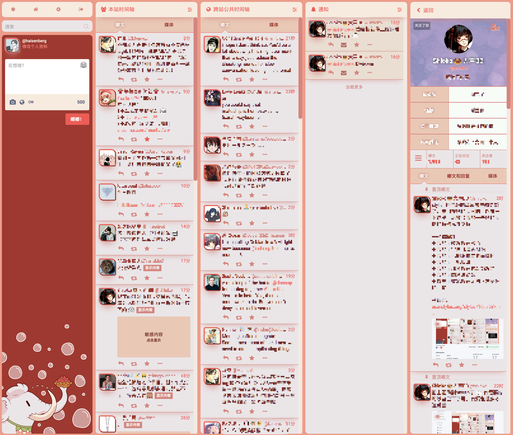

### Strawberry Template for Mastodon
Copyright (c) 2018 By Shioko@cmx.im

**License**: [Creative Commons Attribution 4.0 International (CC BY-NC-SA 4.0)](https://creativecommons.org/licenses/by-nc-sa/4.0/).

Strawberry theme for [Mastodon](https://github.com/tootsuite/mastodon).

It's created by Shioko@cmx.im for cmx.im instance, you can install it on your instance, or use it via stylish.

## Install
### For instance admin
1. Copy `strawberry.scss` into `app/javascript/styles/` and `elephant.png` into `public/strawberry`.
2. Add the following line in `config/themes.yml`:
`strawberry: styles/strawberry.scss`.
3. Recompile assets by running `RAILS_ENV=production bundle exec rails assets:precompile` (in Docker: `docker-compose run --rm web rails assets:precompile`).
4. Restart mastodon-web
5. `strawberry` will be available to choose from `Preferences`->`Site theme` dropdown menu.

### For users
If your instance does not have this theme installed, you can install it locally with [stylish](https://userstyles.org/styles/160753/mastodon).

## Bug report
`shioko@cmx.im` or `haisenberg@cmx.im`
